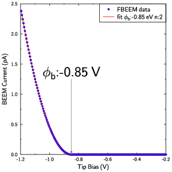
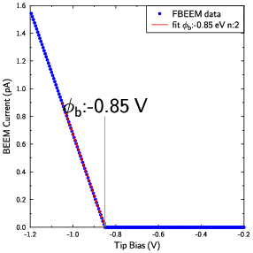
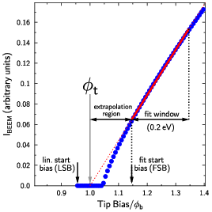

# beemfit

Beemfit is a fitting routine for spectra measured with ballistic electron emission microscopy (BEEM), which determines the Schottky barrier height of a metal-semiconductor interface.  It linearizes the data and searches over all possible fits to find the best fit.  It outputs the Schottky barrier height in eV and amplitude of the spectra, as well as the linearization parameters.

## Usage

beemfit is run from the command line.  The file with the data `data.csv` should be in a two column CSV format (tip bias V , BEEM current in pA), where blank lines and lines that begin with '#' are ignored.  For example:

```
# my BEEM data
# this is comment and will be ignored
#vtip,ibeem
-0.8,0,0
-0.805,0,0
-0.81,0,0
-0.815,0,0
-0.82,0,0
-0.825,0,0
-0.83,0,0
-0.835,0,0
-0.84,0,0
-0.845,0,0
-0.85,0,0
-0.855,0.0005,0
-0.86,0.002,0
-0.865,0.0045,0
-0.87,0.008,0
```

To fit this data type:
```
beemfit --input_filename=data.csv
```
The output will appear
```
beemfit v 1.1.0 BEEM Spectroscopy Fitter
Copyright (C) V.P. LaBella 2007-2024 [Nov 4 2024 15:49:43]
Filename             :  FBEEM_spectra.dat
BEEM Type            :  Forward BEEM
Points               :  200
*** Fit Found ***
Schottky             :  0.85 eV
n (power)            :  2
R_squared            :  1
R_squared_full       :  1
amplitude            :  20
b                    :  -3.80132
b_error              :  1.72718e-15
b_fractional_error   :  4.54364e-16
m                    :  -4.47214
m_error              :  1.81951e-15
m_fractional_error   :  4.06855e-16
Fit Start Bias       :  -0.85 V
Window Size          :  0.2 V
Lin Start Bias       :  -0.655 V
Lin Start Current    :  0 pA
Lin Start Sep        :  0.195 V
Schottky Sep         :  0 V
Max Lin Start Sep    :  0.2 V
Max Schottky Sep     :  0.15 V
Fit Filename         :  FBEEM_spectra_fit.dat
Fit Param. Filename  :  FBEEM_spectra_parameters.dat
```

Two additional files will be created, one with the original data and corresponding fit and another with the parameters of the fit, that is displayed on the screen.  

## Options

Several other options are available and can be seen with the `--help` command shown below.

```
beemfit v 1.1.0 BEEM Spectroscopy Fitter
Copyright (C) V.P. LaBella 2007-2024 [Nov 7 2024 10:13:36]
Allowed Options:
  --help                                Display help message, what you are
                                        reading now.
  --quiet                               Do not display messages
  --input_filename arg (=beemdata.csv)  The filename to read that contains the
                                        BEEM data in CSV format
  --power arg (=0)                      The power of the fit. e.g.:
                                        2,2.5,4,4.5. unspecified will choose 2
                                        or 4
  --auto_power                          automatically determine power (n) from
                                        the type of spectra (will make 2 fits
                                        BK & PL).
  --window_size arg (=0.2)              The window size for linear fitting
                                        (default 0.2)
  --min_r_squared arg (=0.6)            Minimum acceptable R squared value for
                                        a fit considered to be good, default
                                        0.6
  --max_lin_start_fit_start_separation arg (=0.2)
                                        Maximum allowable energy between the
                                        lin start and fit start point in volts
                                        (default 0.2)
  --max_schottky_start_fit_start_separation arg (=0.15)
                                        Maximum allowable energy between
                                        Schottky and fit start point in volts
                                        (default 0.15)
  --no_report                           Do not show fitting report at end.
  --report_iterations arg (=100000)     number of fits (even) before issuing a
                                        report -1=at end (default), 0=no report

```


## Fitting Routine


The program fits the data to simplified Bell & Kaiser BEEM spectroscopy model [1].

$$
I_{BEEM} = A (V_{tip} - \phi_b)^n ,
$$

where $I_{BEEM}$ is the BEEM current, $V_{tip}$ is the tip bias, $A$ is the amplitude, $\phi_b$ is the barrier height, and $n$ is an exponent, typically 2 or 5/2. The equation is linearized by raising both sides to the ${1 \over n}$ power are rewriting in $y=mx+b$ form

$$
 \sqrt[n]{I_{BEEM}} = \sqrt[n]{A} V_{tip} - \sqrt[n]{A}\phi_b,
$$

where $y=\sqrt[n]{I_{BEEM}}$ and $x=V_{tip}$.  Linear regression is then utilized to compute the offset $b$, and slope $m$ from which the amplitude and barrier height can be calculated using $A=m^n$ and $\phi_b = {b \over m}$.


It first linearizes the data and then uses linear regression to obtain the best fit. A linearization starting point (tip bias) is first chosen.  The program then attempts all possible fits to the data for that linearization starting point. IT fits the data over a window of 0.2 V called the fit window. It searches over all possible linearization starting points in the data.  In this way every possible fit is attempted and the best one is found based on the best R squared value.  In addition, these sanity checks are used: 1.) Schottky barrier height must not be too close to spectrum endpoints; 2.) Schottky barrier height must not be too far from linearization start.; 3.) Best linear fit must also be a best fit for the non-linearized data.

## Example Fits

Here is a fit to an artificially created BEEM spectra with a barrier height of 0.85 showing both the regular and linear fit.

    

## BEEM Type

The fitting program automatically detects the type of BEEM spectra based on the sign of the tip bias and BEEM current.  It assumes that the tip is biased with respect to the sample and the BEEM current is measured from the contact to the semiconductor.  Forward BEEM or FBEEM is performed on a metal / n-type semiconductor interface, where the tip bias is negative and the BEEM current is positive.  Reverse BEEM or RBEEM is performed on a metal / n-type semiconductor interface, where the tip bias is positive and the BEEM current is positive. Forward BHEM (ballistic hole emission microscopy) or FBHEM is performed on a metal / p-type semiconductor interface, where the tip bias is positive and the BEEM current is negative.  Reverse BHEM or RBHEM is performed on a metal / p-type semiconductor interface, where the tip bias is negative and the BEEM current is negative.  The table below summarizes them

|  BEEM TYPE  | Semiconductor | Tip Bias  | BEEM Current | Comments |
|--------------|-----------|------------|--|--|
|   FBEEM | n-type | Negative | Positive | |
|   RBEEM | n-type | Positive | Positive | BEEM current is usually 10x smaller than FBEEM |
|   FBHEM | p-type | Positive | Negative | |
|   RBHEM | p-type | Negative | Negative | BEEM current is usually 10x smaller than FBHEM |

## Fit Anatomy

The are several parameters, besides the Schottky barrier height, amplitude, and R^2 value that the program computes.  The figure below shows the anatomy of a fit with the parameters labeled, where $\phi_t$ is the barrier height or spectra threshold.  This type of fit occurs when there is a deviation in the current from the ideal behavior near the threshold.  One of the most common reasons for the deviation is averaging multiple spectra from different tip positions that may have different barrier heights arising from naturally occurring inhomogeneity at the interface.

Ideally, the linearization start bias (LSB), fit start bias (FSB) and threshold $\phi_t$ should all be the same.  This is not always the case for measured spectra.  The LSB is where the program starts linearizing the data.  The FSB is where the linear regression starts.  The extrapolation region is the region from the LSB to the threshold.  The program is set to allow a maximum extrapolation region of 0.15 eV and is adjustable with `--max_schottky_start_fit_start_separation` program option.  The maximum energy between the LSB and FSB is set to 0.2 eV and adjustable with the `--max_lin_start_fit_start_separation`.  It may be tempting to set both these to 0, however giving the routine some room allows it to fit spectra that may not be ideal, capturing the true threshold of the spectra.  Non ideal spectra can occur due to numerous reasons such as inhomogeneities, noise, hot electron scattering, etc. and may be a sign that something interesting or detrimental is occurring at the interface or in the measurement.



# Acknowledgment

If you utilize this routine in your presentations or publications I would appreciate a mention of beemfit in the acknowledgements.  This routing was developed over several years and fitting hundreds of thousands of BEEM spectra taken be numerous hard working graduate students.  The original linearization algorithm was first implemented by Robert Balsano [2]. The algorithm in its current form has been modified and improved upon since that time and has been used to fit spectra from numerous different M/S interfaces.

# References

[1] L. D. Bell and W. J. Kaiser, Phys. Rev. Lett. 61, 2368 (1988). https://doi.org/10.1103/PhysRevLett.61.2368

[2] Schottky barrier height measurements of Cu/Si(001), Ag/Si(001), and Au/Si(001) interfaces utilizing ballistic electron emission microscopy and ballistic hole emission microscopy, Robert Balsano, Akitomo Matsubayashi, Vincent P. LaBella, AIP Advances, 3 112110 (2013). DOI: https://doi.org/10.1063/1.4831756